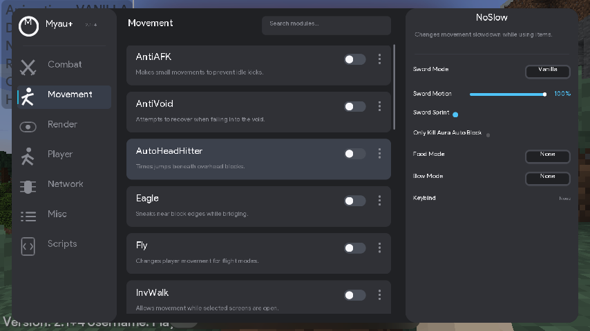

# Open Myau Plus


 
[Myau Client](https://myau.sell.app/),  OpenMyau But Better. 


Open Myau Plus is an enhanced version of the original OpenMyau client, built with additional features, optimizations, and quality-of-life improvements. This project focuses on expanding the core functionality while maintaining stability and performance.

🔗 Official Client: https://myau.sell.app/

---

# Features & Improvements

- Various bug fixes and performance improvements
- Enhanced overall user experience compared to the base version

## ClickGUI

Press **Right Shift** in a world to open the GUI. The default **Tenacity** style
uses a dark category sidebar, cyan-to-pink module toggles, and a separate settings
panel. Existing configurations keep their saved style; choose **Tenacity** in
**ClickGUI → Style** to switch. All previous styles remain available.

- Left-click a module row to toggle it.
- Click its three-dot button or right-click the row to show settings.
- Left/right-click a mode value to cycle forward/backward.
- Middle-click a module or click **Keybind** to assign a key. Delete/Backspace
  clears the binding; Escape cancels binding or closes the GUI.
- Scroll over the module list or settings panel to scroll that panel.
- Drag the branding area to move the window. The layout fits smaller GUI scales.

The Watchdog NoSlow mode now avoids applying movement scaling twice, swaps slots
only during active item use, respects its disabled state, and clears temporary
state on toggles and world changes. These fixes are covered by regression tests;
compatibility with current Hypixel Watchdog detections has not been verified on
a live server.



---

# About

This project is based on OpenMyau, with the goal of refining and extending its capabilities beyond the original implementation.

---

#  Issues & Suggestions

If you encounter any bugs or have ideas for new features, feel free to open an issue:

 https://github.com/IamNespola/OpenMyau-Plus/issues

---

# Building

Run Gradle with JDK 17 or newer. Compilation uses a **full Temurin JDK 8**,
including `bin/javac` and `lib/tools.jar`; a Java 8 JRE is insufficient. Gradle's
Foojay resolver can download this toolchain automatically. For offline builds,
install Temurin JDK 8 beforehand and set `org.gradle.java.installations.paths`
to its JDK root (not its `jre` subdirectory) in your Gradle user properties.

To build the project, run:

```bash
git clone https://github.com/thxrul/OpenMyau-Plus.git
cd OpenMyau-Plus
./gradlew build
```

This produces a single `build/libs/Myau+.jar-2.1+4.jar` containing **both** the client and its
scripting support.

The verified compiled jar is also available as
[MyauPlus-2.1+4.jar](https://github.com/thxrul/OpenMyau-Plus/raw/refs/heads/main/dist/MyauPlus-2.1+4.jar).
Its SHA-256 checksum is stored in [dist/SHA256SUMS](dist/SHA256SUMS).

---

# Scripting (Raven Script Loader)

Script support comes from [`rsl/`](rsl/), a vendored copy of
[Raven Script Loader](https://codeberg.org/monster-energy/raven-script-loader). It is
bundled into the client jar rather than shipped separately: the root build compiles
`rsl/src/main/java` and `rsl/src/main/resources` as extra source directories, so one jar
registers **two Forge mods** — `myau` and `rsl` — under the mixin configs
`mixins.myau.json,mixins.rsl.json`.

RSL's own `build.gradle.kts` and wrapper are **not used** (they need a Java 21+ JVM). Keeping
it in the root build means one compile and one remap pass, with both mixin configs sharing a
single generated refmap. Install just the one jar.

Scripts drive the client through the `myau.*` API, which has no compile-time link to the
client — it issues chat commands (`.t <module>`, `.<module> <property> <value>`) that Myau+
intercepts on the outgoing chat packet, and reads back the replies while suppressing them
from the chat GUI. That bridge depends on Myau+'s command output format, so changes to
command replies can break scripts.

See [`rsl/UPSTREAM.md`](rsl/UPSTREAM.md) for provenance, the local patches applied on top of
upstream, and how to pull updates.

---

#  Contributing

Contributions are welcome! You can:

- Open an issue
- Submit a pull request

---
#  Support

If you like this project, consider giving it a star on GitHub — it really helps!
---

#  Contact

If you're interested in collaborating or have any questions, feel free to reach out:

- Discord: https://dsc.gg/nespola
- Username: @nespola1

---

# © License

This project follows the same licensing terms as the original OpenMyau project unless stated otherwise.
